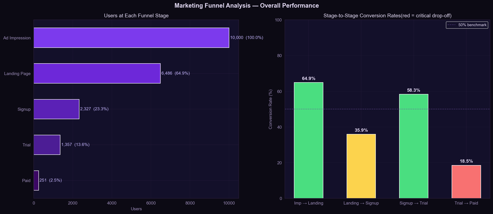
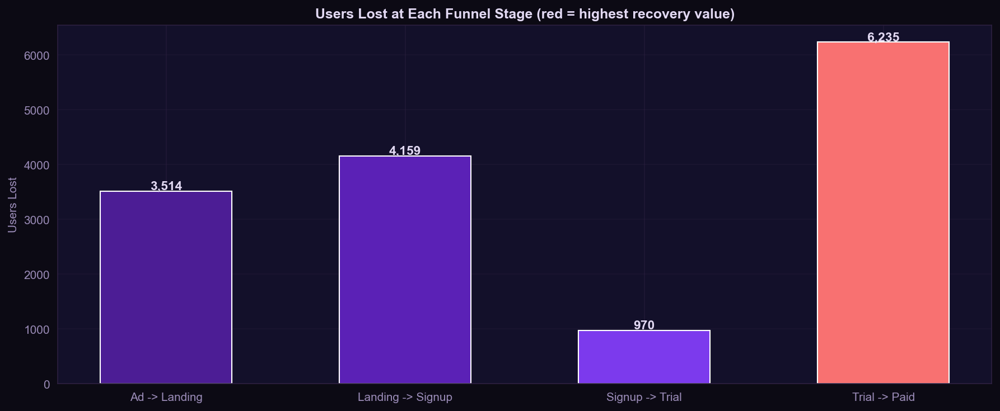
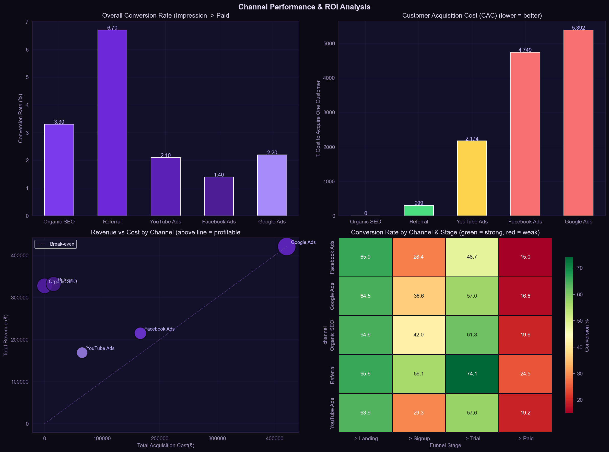
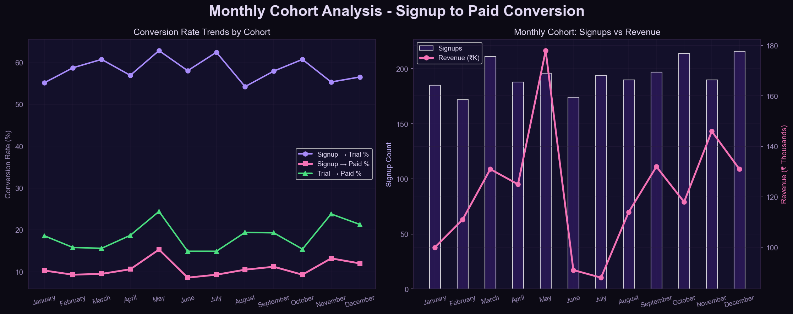
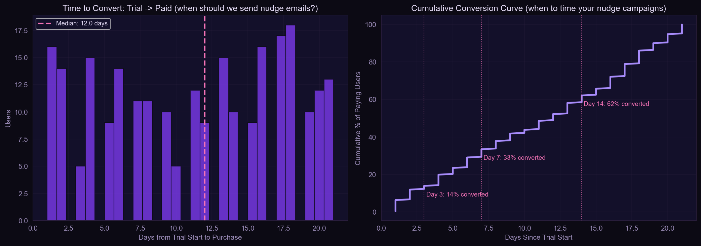

# EdTech Marketing Funnel Analytics
### Identifying Where Users Drop Off, Which Channels Drive Real ROI, and When to Send Nudge Campaigns — Jan to Dec 2025



---

## Table of Contents
1. [Project Background](#project-background)
2. [North-Star Metrics](#north-star-metrics)
3. [Executive Summary](#executive-summary)
4. [Insight Deep Dive](#insight-deep-dive)
   - [Funnel Drop-off Analysis](#1-funnel-drop-off-analysis)
   - [Channel ROI Ranking](#2-channel-roi-ranking)
   - [Conversion by Device](#3-conversion-by-device)
   - [Monthly Cohort Trends](#4-monthly-cohort-trends)
   - [Time-to-Convert and Nudge Timing](#5-time-to-convert-and-nudge-timing)
5. [Recommendations](#recommendations)
6. [Tech Stack](#tech-stack)

---

## Project Background

### Context

EdTech companies like upGrad, Unacademy, and PhysicsWallah spend crores every month acquiring users through paid ads, SEO, YouTube, and referral programs. But acquiring a user is only the first step. A user who sees an ad and a user who pays for a course are separated by four distinct stages — and most users never make it through.

The growth team's core problem is not traffic. It is **conversion**. Understanding exactly where users drop off, which channels bring users who actually pay, and when the highest-leverage moment to intervene is — these are the questions that determine whether a marketing budget generates revenue or just generates signups.

This project simulates the work of a **Data Analyst embedded in an EdTech growth team**, reporting to the Head of Growth. The analysis covers a full multi-channel marketing funnel from ad impression to paid conversion across five acquisition channels and twelve months of data.

### Dataset

This project uses a **synthetic dataset of 10,000 users** generated to mirror the schema and behavioral patterns of real EdTech funnel data tracked through tools like Mixpanel, Amplitude, or Google Analytics. Each row represents one user's journey through the funnel.

| Field | Description |
|---|---|
| `user_id` | Unique user identifier |
| `channel` | Acquisition channel — Google Ads / Facebook Ads / YouTube Ads / Organic SEO / Referral |
| `device` | Device type — Mobile / Desktop / Tablet |
| `course_interest` | Course category — Data Science / Web Dev / Digital Marketing / Finance / Design |
| `ad_date` | Timestamp of ad impression |
| `reached_landing` | Boolean — did user visit the landing page? |
| `signed_up` | Boolean — did user create an account? |
| `started_trial` | Boolean — did user access free trial content? |
| `converted_paid` | Boolean — did user purchase a course? |
| `revenue` | Revenue generated (₹0 for non-payers) |
| `cpc` | Cost per click for the channel |

**The funnel modelled:**

```
Ad Impression → Landing Page → Signup → Trial → Paid
    10,000          6,486        2,327    1,357    251
```

**Channel costs used:**

| Channel | Cost Per Click |
|---|---|
| Google Ads | ₹120 |
| Facebook Ads | ₹65 |
| YouTube Ads | ₹45 |
| Referral | ₹20 (referral bonus) |
| Organic SEO | ₹0 (free channel) |

### Goal

> *"We are converting only 2.5% of users who see our ads into paying customers. Which stage is bleeding the most users, which channels are worth the spend, and where should the growth team focus next quarter?"*

---

## North-Star Metrics

Five metrics drive every growth decision in EdTech analytics. Every finding in this project traces back to at least one of them.

| Metric | Definition | Benchmark | Actual | Status |
|---|---|---|---|---|
| **Overall Conversion Rate** | % of ad impressions that result in a paid purchase | 3–5% | **2.51%** | Below benchmark |
| **Trial-to-Paid Rate** | % of trial users who convert to paying customers | 20–25% | **18.5%** | Slightly below |
| **Customer Acquisition Cost (CAC)** | Total channel spend ÷ paying customers acquired | < ₹3,000 | **₹299–₹5,392** | Varies dramatically by channel |
| **LTV:CAC Ratio** | Average revenue per customer ÷ CAC | > 3x | **1.0x–inf** | Critical gap on Google Ads |
| **Landing-to-Signup Rate** | % of landing page visitors who create an account | 40–50% | **35.9%** | Below benchmark |

### Why these five?

**Overall Conversion Rate** is the single number the CEO reads. It tells you how efficiently the entire funnel converts spend into revenue.

**Trial-to-Paid Rate** is the growth team's most controllable lever. Users in trial have already shown intent — the product experience and re-engagement campaigns directly influence this number.

**CAC** determines whether each channel is financially viable. A channel can have excellent conversion rates but unsustainable acquisition costs.

**LTV:CAC Ratio** is the investor and CFO metric. A ratio below 3x means you are spending too much to acquire customers relative to what they generate. Google Ads at 1.0x is a structural problem.

**Landing-to-Signup Rate** at 35.9% against a 40–50% benchmark indicates the landing page or signup flow has friction that is costing the top of the funnel before channels even get a chance to prove themselves.

---

## Executive Summary

The EdTech marketing funnel processed **10,000 users across January to December 2025**, producing **251 paying customers** at an overall conversion rate of **2.51%** and total revenue of **₹14,64,749**. The average order value is ₹5,836.

The funnel has four stages of attrition, and they are not equal. The largest volume loss occurs at **Landing-to-Signup (4,159 users lost, 35.9% conversion)**, but the highest-value loss occurs at **Trial-to-Paid (6,235 users lost, 18.5% conversion)**. Recovering just 10% of trial drop-offs would generate an estimated **₹36,38,530 in additional revenue** — 2.5 times the total revenue currently generated. This is the highest-leverage intervention in the entire funnel.

Channel performance is dramatically uneven. **Referral is the highest-performing paid channel** with a 6.70% overall conversion rate, a CAC of ₹299, and a LTV:CAC ratio of 21.35x. **Organic SEO delivers infinite ROI** (zero acquisition cost) with a 3.30% conversion rate. At the other end, **Google Ads has a LTV:CAC ratio of 1.0x** — the company is spending as much to acquire customers as those customers generate, leaving zero margin. Facebook Ads shows the lowest conversion rate at 1.40% with a CAC of ₹4,749.

Cohort analysis across 12 months reveals that **May is the highest-performing month** with a 24.4% trial-to-paid rate and ₹1,77,970 in revenue, while **June and July are the weakest** at 14.9% trial-to-paid. This seasonal pattern suggests an opportunity to concentrate retention campaigns and promotional offers around the May exam-preparation season.

The time-to-convert analysis shows that **only 33% of paying users convert within 7 days** of starting their trial, with a median conversion time of 12 days. The conversion curve rises most steeply between days 10–20, indicating that nudge campaigns should not be front-loaded in the first 3 days as is common practice — they should be distributed across a 2-week window with peak intensity around days 10–14.

---

## Insight Deep Dive

### 1. Funnel Drop-off Analysis




**What the data shows**

The funnel narrows significantly at two points: Landing-to-Signup and Trial-to-Paid.

| Stage Transition | Users In | Users Out | Conversion Rate | Users Lost |
|---|---|---|---|---|
| Ad Impression → Landing | 10,000 | 6,486 | 64.9% | 3,514 |
| Landing → Signup | 6,486 | 2,327 | **35.9%** | 4,159 |
| Signup → Trial | 2,327 | 1,357 | 58.3% | 970 |
| Trial → Paid | 1,357 | 251 | **18.5%** | 6,235 |

The Signup-to-Trial conversion at 58.3% and the Impression-to-Landing at 64.9% are both above the 50% benchmark line — these stages are performing acceptably. The two problem stages are Landing-to-Signup at 35.9% and Trial-to-Paid at 18.5%.

**The Trial-to-Paid stage is where revenue dies**

6,235 users started a trial and did not pay. At an average order value of ₹5,836, this represents a **theoretical maximum recovery value of ₹3,63,85,160** — the ceiling of what better trial-to-paid conversion could unlock. Realistically, recovering 10% of these users (624 users) would generate ₹36,38,530 — 2.5x current total revenue. No other stage offers this return on intervention.

**The Landing-to-Signup gap is a product friction problem**

35.9% of landing page visitors sign up against a benchmark of 40–50%. This 4–14 percentage point gap means 260–900 additional signups per 6,486 landing visitors are being lost to friction — unclear value proposition, slow page load, a long signup form, or a lack of social proof. This is a product and UX fix, not a marketing fix.

**Revenue opportunity quantified:**

```
Trial drop-offs recovered at 10%:  +624 users × ₹5,836 = ₹36,38,530
Signup drop-offs recovered at 5%:  +48 users × ₹1,079* = ₹5,23,510
(*₹5,836 × 18.5% trial-to-paid rate = expected value per signup recovery)
```

The trial recovery is 7x more valuable than the signup recovery on a per-user basis. Fix trial conversion first.

---

### 2. Channel ROI Ranking



**What the data shows**

| Channel | Impressions | Paid Users | Overall CVR | CAC | Avg Revenue | ROI | LTV:CAC |
|---|---|---|---|---|---|---|---|
| Organic SEO | 1,712 | 56 | 3.30% | ₹0 | ₹5,856 | ∞ | ∞ |
| Referral | 777 | 52 | **6.70%** | ₹299 | ₹6,384 | 2036% | **21.35x** |
| YouTube Ads | 1,449 | 30 | 2.10% | ₹2,174 | ₹5,632 | 159% | 2.59x |
| Facebook Ads | 2,557 | 35 | 1.40% | ₹4,749 | ₹6,142 | 29% | 1.29x |
| Google Ads | 3,505 | 78 | 2.20% | ₹5,392 | ₹5,396 | **0.1%** | **1.0x** |

**Referral is the highest-ROI paid channel by a wide margin**

With a 6.70% overall conversion rate — 3x the next best paid channel — and a CAC of ₹299, Referral produces 21.35x return on every rupee spent. Users who arrive through referral have been pre-sold by a trusted peer. They arrive with higher intent, convert more frequently at every funnel stage, and generate higher average order values (₹6,384 vs ₹5,396 for Google Ads).

The funnel heatmap confirms this: Referral has the strongest Signup-to-Trial conversion at 74.1% and the best Trial-to-Paid at 24.5% — both significantly above the overall averages of 58.3% and 18.5%.

**Google Ads is at break-even — structurally unviable at current economics**

Google Ads drives the most absolute volume (3,505 impressions, 78 paying users) but at a CAC of ₹5,392 against an average revenue of ₹5,396, the LTV:CAC ratio is 1.0x. The company is recovering exactly what it spends — before accounting for product costs, salaries, or infrastructure. A standard sustainable LTV:CAC target is 3x. Google Ads is running at one-third of the viable threshold.

The Revenue vs Cost scatter plot makes this visible: Google Ads sits almost exactly on the break-even line, while Referral and Organic SEO sit far above it.

**Facebook Ads underperforms on conversion despite high volume**

Facebook Ads receives 2,557 impressions — the second highest volume — but converts at only 1.40% overall, the lowest of all channels. The funnel heatmap shows Facebook's Signup conversion at 28.4% is the weakest stage — users who click Facebook ads reach the landing page but show the least intent to create an account. The broad, interest-based targeting of Facebook is attracting users who are curious but not motivated, compared to the search-intent users on Google or the peer-recommended users in Referral.

**Budget reallocation implication**

```
Current allocation (by impressions):
Google Ads: 35% → LTV:CAC 1.0x
Facebook:   26% → LTV:CAC 1.29x
Organic SEO:17% → LTV:CAC infinite
YouTube:    14% → LTV:CAC 2.59x
Referral:    8% → LTV:CAC 21.35x

Recommended direction:
↓ Reduce Google Ads and Facebook Ads spend
↑ Invest in Referral program expansion
↑ Invest in Organic SEO content production
```

---

### 3. Conversion by Device

**What the data shows**

| Device | Impressions | Paid Users | Overall CVR | Trial-to-Paid | Revenue |
|---|---|---|---|---|---|
| Desktop | 3,681 | 96 | 2.61% | **18.6%** | ₹5,28,904 |
| Mobile | 5,617 | 141 | 2.51% | 18.8% | ₹8,52,859 |
| Tablet | 702 | 14 | 1.99% | 15.6% | ₹82,986 |

At first glance, Mobile appears to be the dominant device — 56% of impressions and 56% of paying users. But two things are worth examining carefully.

**Mobile volume obscures Desktop quality**

Desktop has a 2.61% overall conversion rate vs Mobile's 2.51% — a small but consistent difference. More importantly, Tablet has a noticeably lower trial-to-paid rate at 15.6% vs Desktop and Mobile at ~18.7%. The Tablet experience appears to have friction specific to that form factor — likely a checkout or course player UI issue that is not optimised for tablet screen sizes.

**Mobile dominance reflects where users enter, not necessarily where they convert best**

56% of impressions come from mobile because that is where ads are seen — on Instagram feeds, YouTube pre-rolls, and Google search on phones. The conversion rates being nearly equal across Desktop and Mobile suggests that users are relatively comfortable completing purchases on both. The growth team should not assume a "desktop converts better" narrative from this data — the numbers do not support it at a significant level.

**What should change**

Audit the Tablet experience specifically — a 15.6% trial-to-paid rate vs 18.6–18.8% on other devices suggests a checkout or UX issue. Fixing the tablet flow is a low-effort, moderate-impact improvement.

---

### 4. Monthly Cohort Trends



**What the data shows**

| Month | Signups | Trials | Paid | Trial Rate | Trial→Paid | Revenue |
|---|---|---|---|---|---|---|
| January | 185 | 102 | 19 | 55.1% | 18.6% | ₹99,981 |
| February | 172 | 101 | 16 | 58.7% | 15.8% | ₹1,10,984 |
| March | 211 | 128 | 20 | 60.7% | 15.6% | ₹1,30,980 |
| April | 188 | 107 | 20 | 56.9% | 18.7% | ₹1,24,980 |
| **May** | **196** | **123** | **30** | **62.8%** | **24.4%** | **₹1,77,970** |
| June | 174 | 101 | 15 | 58.0% | 14.9% | ₹90,985 |
| July | 194 | 121 | 18 | 62.4% | 14.9% | ₹87,982 |
| August | 190 | 103 | 20 | 54.2% | 19.4% | ₹1,13,980 |
| September | 197 | 114 | 22 | 57.9% | 19.3% | ₹1,31,978 |
| October | 214 | 130 | 20 | 60.7% | 15.4% | ₹1,17,980 |
| November | 190 | 105 | 25 | 55.3% | 23.8% | ₹1,45,975 |
| December | 216 | 122 | 26 | 56.5% | 21.3% | ₹1,30,974 |

**May is structurally different from the rest of the year**

May shows a 24.4% trial-to-paid rate — the highest of any month — compared to a 12-month average of approximately 18.7%. May also generates the highest monthly revenue at ₹1,77,970 despite not having the highest signup volume. The driver is almost certainly the **exam and academic season** in India — May marks the end of the board exam cycle and the beginning of college admissions season, when students have high motivation to invest in skill-building courses.

**June and July are the weakest consecutive months**

June (14.9%) and July (14.9%) show back-to-back trial-to-paid rates 4 percentage points below the annual average. Revenue drops sharply from ₹1,77,970 in May to ₹90,985 in June — a 49% decline in one month despite similar signup volumes. This is not a traffic problem — signups in June (174) are close to the annual average. Users are arriving but not converting. This suggests a post-exam motivation dip: students who signed up in June have less urgency because the immediate exam pressure has passed.

**The cohort conversion rate is volatile, not trending**

The Signup-to-Trial rate (purple line) stays consistently in the 54–63% range with no clear upward or downward trend — suggesting product engagement in the free trial is relatively stable. The Trial-to-Paid rate (green line) is where all the variance lives, oscillating between 14.9% and 24.4%. This pattern confirms that the product is retaining users through trial, but the *purchase decision* is being driven by external seasonal factors rather than product improvements.

**What should change**

Design a May activation campaign: identify May cohort users who trialled and paid and understand what triggered their conversion (course completion milestone, peer encouragement, deadline pressure). Build a replication strategy that artificially creates that urgency during low-conversion months like June and July — limited-time pricing, cohort enrollment deadlines, or study-group mechanisms.

---

### 5. Time-to-Convert and Nudge Timing



**What the data shows**

```
Median days trial → paid:     12.0 days
% converting within 3 days:   14%
% converting within 7 days:   33%
% converting within 14 days:  62%
```

The histogram of days-to-convert shows a roughly uniform distribution between days 1–20 with a slight peak around days 17–18. There is no sharp early conversion spike — users are not making impulsive purchase decisions in the first 1–3 days. The cumulative conversion curve rises steadily and does not show any sharp inflection point until after day 14.

**The common nudge strategy is wrong**

Most EdTech companies front-load their trial nurture emails — a welcome email on day 1, a feature highlight on day 2, a discount offer on day 3. This project's data does not support that approach. Only 14% of paying users convert within 3 days. The remaining 86% are still in consideration mode, and aggressive early discounting trains users to wait for offers rather than converting at full price.

**The 12-day median tells you where to concentrate**

With a median of 12 days and 62% of conversions happening by day 14, the data suggests a 2-week window is the relevant conversion period. Users who have not converted by day 21 have very low probability of doing so — the cumulative curve flattens after day 20.

**Recommended nudge sequence based on conversion data:**

```
Day 1:   Welcome — "here is what you can access" (orientation, not selling)
Day 3:   Progress nudge — "you have completed X% of your free content"
Day 7:   Social proof — "students who completed this course now earn X"
Day 10:  Urgency signal — "your trial access expires in 10 days"
Day 12:  Offer — discount or payment plan (timed to median conversion day)
Day 14:  Final nudge — "48 hours remaining on your trial"
Day 21:  Win-back — last attempt with maximum incentive
```

The key principle: save your discount for day 12, not day 3. Users who are going to convert early will convert without a discount. Users who need a push are in the 7–14 day window — that is where the offer has the highest marginal impact.

---

## Recommendations

Prioritised by revenue impact:

| Priority | Action | Target Metric | Expected Impact | Timeline |
|---|---|---|---|---|
| 1 | Trial re-engagement email sequence peaking at days 10–14 | Trial→Paid: 18.5% → 22% | +₹20L+ revenue at current volume | 3 weeks |
| 2 | Shift 20% of Google Ads budget to Referral program expansion | Google Ads LTV:CAC: 1.0x → 2x+ | Reduce wasted acquisition spend | 1 month |
| 3 | Landing page A/B test — simplify signup flow | Landing→Signup: 35.9% → 40% | +260 signups per 6,486 visitors | 2 weeks |
| 4 | May activation campaign — replicate high-conversion triggers in Jun–Jul | Jun–Jul trial→paid: 14.9% → 18% | +₹8–10L in low-season months | 6 weeks |
| 5 | Fix Tablet checkout experience | Tablet trial→paid: 15.6% → 18%+ | Closes device parity gap | 2 weeks |
| 6 | Invest in Organic SEO content | SEO CVR already 3.30% at ₹0 cost | Every incremental SEO user is pure margin | Ongoing |

---

## Tech Stack

```
Python 3.11         End-to-end analysis pipeline
Pandas              Data generation, feature engineering, aggregation
NumPy               Probabilistic funnel simulation and distributions
Matplotlib          EDA charts, drop-off analysis, cohort visualisation
Seaborn             Channel conversion heatmap
Plotly              Interactive multi-panel funnel dashboard (HTML)
Jupyter Notebook    Analysis narrative combining code, outputs, findings
```

---

*Dataset: 10,000 synthetic users modelled on Mixpanel/Amplitude funnel schema | Period: Jan–Dec 2025 | 5 channels | 5 course categories*

*Built as part of a Data Analyst portfolio targeting growth analytics roles at upGrad, Unacademy, PhysicsWallah, Byjus, and Simplilearn.*
